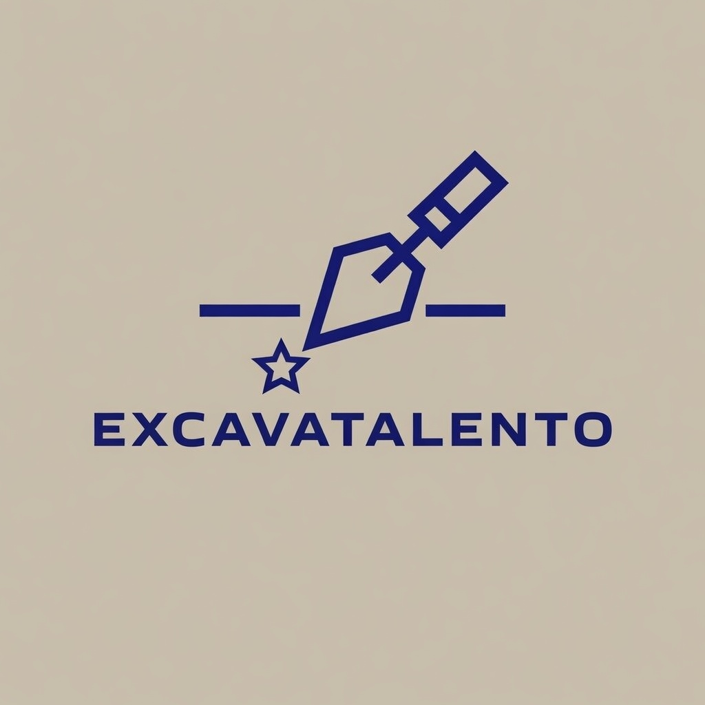

```{r}
#| label: setup
#| include: false

source("R/00_paquetes.R")

encuesta <- read_csv(
  "data/processed/encuesta_dashboard.csv",
  show_col_types = FALSE
)

frecuencia_departamentos <- read_csv(
  "data/processed/frecuencia_departamentos.csv",
  show_col_types = FALSE
)

n_participantes <- nrow(encuesta)

n_departamentos <- frecuencia_departamentos %>%
  filter(n > 0) %>%
  nrow()

n_preguntas <- ncol(encuesta) - 2

fecha_hoy <- format(Sys.Date(), "%B %Y")

#prueba
```

::: {.hero}

::: {.hero-logo}



:::
:::

# Observatorio del Mercado Laboral de la Arqueología Colombiana

## Primera Encuesta Nacional 2026

Información basada en datos para comprender la realidad laboral de la arqueología en Colombia.

::: {.hero-stat}

**`r n_participantes`** participantes • **`r n_departamentos`** departamentos representados

:::

[Explorar Dashboard →](dashboard/resumen.qmd){.btn-explorar}

:::

------------------------------------------------------------------------

# Bienvenido

Este observatorio presenta los resultados de la primera encuesta nacional sobre el mercado laboral de la arqueología en Colombia.

Su propósito es ofrecer información confiable sobre empleo, salarios, formación académica, competencias, condiciones laborales y distribución territorial de los profesionales del sector.

Está dirigido a:

- Profesionales de la arqueología.
- Estudiantes.
- Universidades.
- Empresas consultoras.
- Constructoras.
- Entidades públicas.
- Investigadores.
- Medios de comunicación.

------------------------------------------------------------------------

# Indicadores principales

::: {.kpi-grid}

::: {.kpi-card}

### 👥 Participantes

# `r n_participantes`

Personas que respondieron la encuesta.

:::

::: {.kpi-card}

### 📍 Cobertura

# `r n_departamentos`

Departamentos representados.

:::

::: {.kpi-card}

### 📋 Preguntas

# 22

Variables analizadas.

:::

::: {.kpi-card}

### 📅 Año

# 2026

Primera edición de la encuesta.

:::

:::

------------------------------------------------------------------------

# ¿Qué encontrará en este observatorio?

::: {.columns}

::: {.column width="50%"}

### 📊 Resumen Ejecutivo

Principales indicadores del mercado laboral.

### 💰 Salarios

Distribución de ingresos y análisis salarial.

### 🏛 Mercado Laboral

Sectores de trabajo, cargos y estabilidad laboral.

### 🎓 Formación Académica

Nivel educativo y estudios de posgrado.

:::

::: {.column width="50%"}

### 🛠 Competencias

Herramientas tecnológicas utilizadas por los profesionales.

### 🗺 Distribución Territorial

Cobertura nacional por departamentos.

### 🔎 Explorador

Consulta interactiva de todos los resultados.

### 📖 Metodología

Diseño de la encuesta y tratamiento de los datos.

:::

:::

------------------------------------------------------------------------

# Cobertura de la encuesta

| Indicador | Valor |
|-----------|------:|
| Participantes | `r n_participantes` |
| Departamentos representados | `r n_departamentos` |
| Preguntas | 22 |
| Año | 2026 |

------------------------------------------------------------------------

# Objetivo del Observatorio

El Observatorio del Mercado Laboral de la Arqueología Colombiana busca generar evidencia para comprender las condiciones laborales de los arqueólogos en el país y facilitar la toma de decisiones por parte de profesionales, universidades, empresas y entidades públicas.

Los resultados permiten analizar aspectos relacionados con:

- Empleo.
- Salarios.
- Formación académica.
- Competencias técnicas.
- Distribución territorial.
- Percepción del mercado laboral.
- Retos y oportunidades para la profesión.

------------------------------------------------------------------------

# Metodología

- **Instrumento:** Encuesta en línea.
- **Cobertura:** Colombia.
- **Población objetivo:** Profesionales y estudiantes de arqueología.
- **Participantes:** `r n_participantes`.
- **Fecha de publicación:** `r fecha_hoy`.

------------------------------------------------------------------------

::: {.callout-tip}

## Comience a explorar

Acceda al **Resumen Ejecutivo** para consultar los principales indicadores del mercado laboral de la arqueología en Colombia.

[**Ir al Dashboard →**](dashboard/resumen.qmd)

:::


